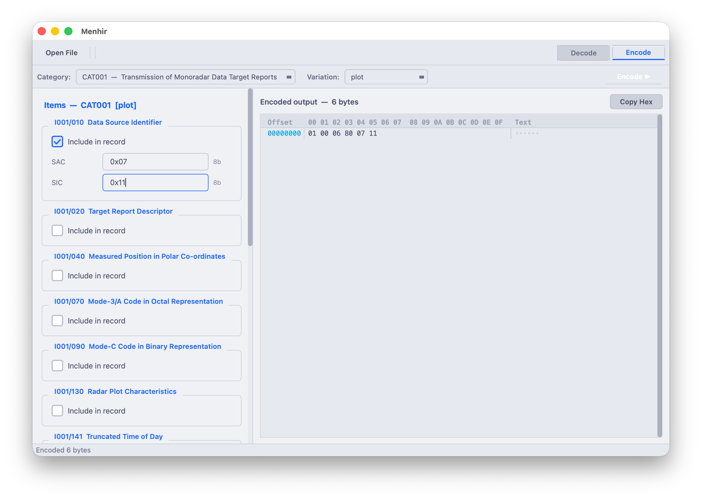

<div align="center">
  
  <h1>Menhir</h1>
  <p>ASTERIX encode/decode workbench for Air Traffic Management engineers</p>

  [](https://github.com/nathan-casabieille/Menhir/actions/workflows/ci-linux.yml)
  [](https://github.com/nathan-casabieille/Menhir/actions/workflows/ci-macos.yml)
  [](https://github.com/nathan-casabieille/Menhir/actions/workflows/ci-windows.yml)
</div>

---

Menhir is a desktop application built on top of [ASTERIXCodec](https://github.com/nathan-casabieille/ASTERIXCodec). It provides a Wireshark-style interface for visually inspecting ASTERIX surveillance frames and manually crafting new ones.

## Features

**Decode mode**
- Open a binary ASTERIX file via drag-and-drop, the toolbar, or `Ctrl+O`
- Type or paste raw hex bytes directly in the interactive hex editor
- Hit `F5` (or wait for the auto-decode timer) to get a fully annotated field tree
- Each Data Item is color-coded — clicking a tree node scrolls to and highlights the corresponding bytes in the hex editor, and moving the cursor in the hex editor synchronises the tree selection

**Encode mode**
- Select a category and UAP variation from the toolbar
- Fill in the structured form; the encoded output updates live as you type
- Copy the result as a hex string with one click

**Hex editor**
- Type hex digits directly at the cursor — no separate text field
- Navigate with arrow keys, `Home`, `End`, `Page Up/Down`
- `Backspace` undoes the last nibble or deletes the previous byte; `Delete` removes the byte at the cursor
- Color-coded byte ranges for at-a-glance attribution

## In action

**Decode mode** — annotated field tree synchronized with the hex editor


**Encode mode** — structured form with live hex output



## Supported categories

| Category | Description | Edition |
|----------|-------------|---------|
| CAT001 | Transmission of Monoradar Data Target Reports | 1.4 |
| CAT002 | Transmission of Monoradar Service Messages | 1.2 |
| CAT004 | Safety Net Messages | 1.13 |
| CAT007 | Transmission of Directed Interrogation Messages | 1.12 |
| CAT008 | Monoradar Derived Weather Information | 1.3 |
| CAT009 | Composite Weather Reports | 2.1 |
| CAT010 | Transmission of Monosensor Surface Movement Data | 1.1 |
| CAT011 | Transmission of A-SMGCS Data | 1.3 |
| CAT015 | Independent Non-Cooperative Surveillance System Target Reports | 1.2 |
| CAT016 | Transmission of Data Link Flight Messages | 1.0 |
| CAT017 | Mode S Surveillance Coordination Function Messages | 1.3 |
| CAT018 | Mode S Datalink Function Messages | 1.8 |
| CAT019 | Multilateration System Status Messages | 1.3 |
| CAT020 | Multilateration Target Reports | 1.11 |
| CAT021 | ADS-B Target Reports | 2.7 |
| CAT023 | CNS/ATM Ground Station and Service Status Reports | 1.3 |
| CAT025 | CNS/ATM Ground System Status Reports | 1.6 |
| CAT032 | Miniplan Reports to an SDPS | 1.2 |
| CAT034 | Transmission of Monoradar Service Messages | 1.29 |
| CAT048 | Monoradar Target Reports | 1.32 |
| CAT062 | SDPS Track Messages | 1.21 |
| CAT063 | Sensor Status Reports | 1.7 |
| CAT065 | SDPS Service Status Reports | 1.6 |
| CAT150 | MADAP Plan Server - Flight Data Message | 3.0 |
| CAT205 | Radio Direction Finder Reports | 1.0 |
| CAT240 | Radar Video Transmission | 1.3 |
| CAT247 | Version Number Exchange | 1.3 |

## Requirements

| Dependency | Version |
|------------|---------|
| CMake | ≥ 3.21 |
| Qt | 6.x (Widgets module) |
| C++ compiler | C++20 (GCC 12+, Clang 15+, MSVC 2022+) |

## Build

```bash
git clone https://github.com/nathan-casabieille/Menhir.git
cd Menhir
cmake -B build -DCMAKE_BUILD_TYPE=Release
cmake --build build -j$(nproc)
```

CMake fetches [ASTERIXCodec](https://github.com/nathan-casabieille/ASTERIXCodec) automatically — no manual dependency step required.

**macOS**
```bash
open build/Menhir.app
```

**Linux**
```bash
./build/Menhir
```

**Windows**
```bash
.\build\Release\Menhir.exe
```

## Project structure

```
Menhir/
├── CMakeLists.txt                  # FetchContent pulls ASTERIXCodec automatically
├── src/
│   ├── main.cpp                    # App entry point, palette and stylesheet setup
│   ├── MainWindow.{hpp,cpp}        # Top-level window, toolbar, Decode/Encode mode switch
│   ├── DecodeView.{hpp,cpp}        # Wireshark-style tree + hex editor (decode mode)
│   ├── EncodePanel.{hpp,cpp}       # Structured form + live hex output (encode mode)
│   ├── HexEditor.{hpp,cpp}         # Custom interactive hex editor widget
│   ├── ByteTracker.{hpp,cpp}       # Maps decoded items to byte ranges in the raw buffer
│   └── Theme.hpp                   # Qt stylesheet, item colors
├── specs/
│   └── CAT*.xml                    # 27 ASTERIX category definitions (CAT001–CAT247)
└── resources/
    ├── specs.qrc                   # Embeds XML specs and icons at compile time
    ├── check.svg                   # Checkbox checkmark icon
    ├── menhir-icon.png             # Application icon (source)
    ├── menhir.icns                 # macOS bundle icon
    └── menhir.ico                  # Windows executable icon
```
